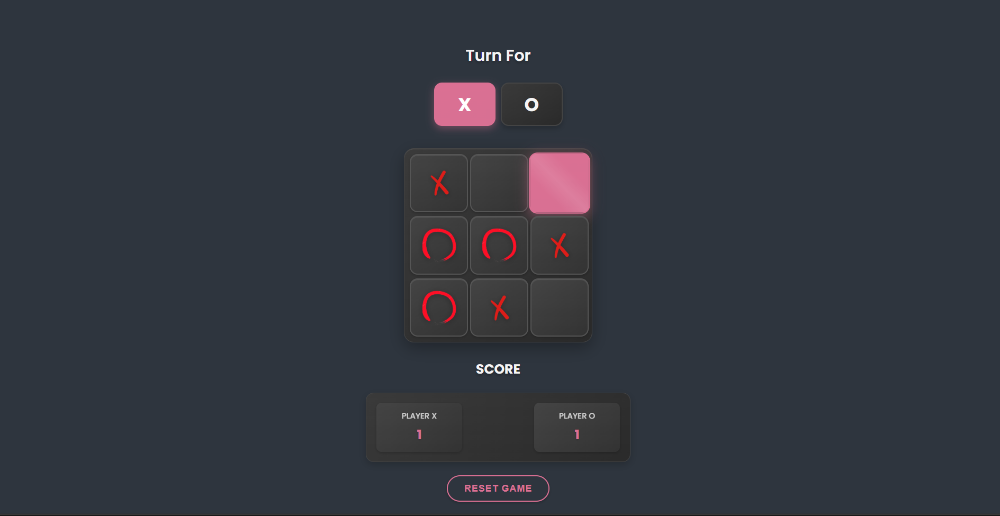

# Tic-Tac-Toe Web Game

A modern, responsive, and visually attractive Tic-Tac-Toe game built with HTML, CSS, and JavaScript. Play with a friend, track scores, and enjoy a beautiful UI with a custom favicon!

## 🚀 Demo
Play it live: [https://kattamzeroo.netlify.app/](https://kattamzeroo.netlify.app/)

## ✨ Features
- Responsive design for desktop and mobile
- Modern, attractive UI and custom favicon
- Alternating first move logic for fairness
- Score tracking for both players
- Reset functionality
- Creative SVG favicon (X and O on a grid)

## 🛠️ Technologies Used
- 📝 **HTML5**
- 🎨 **CSS3**
- ⚡ **JavaScript (ES6)**
- 🔷 **SVG** (for favicon)

## 🖼️ Preview
 <!-- Add a screenshot if available -->

## 🛠️ Setup & Run Locally
1. **Clone the repository:**
   ```bash
   git clone https://github.com/yourusername/tic-tac-toe.git
   cd tic-tac-toe
   ```
2. **Open `index.html` in your browser.**

## 🌐 Deployment
This project is deployed on [Netlify](https://www.netlify.com/). To deploy your own:
1. Push your code to GitHub.
2. Connect your repo to Netlify and deploy.

## 📁 Project Structure
```
├── index.html
├── style.css
├── script.js
├── images/
│   ├── favicon.svg
│   ├── cross.png
│   └── zero.png
├── sitemap.xml
├── robots.txt
└── README.md
```

## 🔍 SEO & Indexing
- Includes `sitemap.xml` and `robots.txt` for search engines
- Meta description and custom favicon
- Google Search Console verification ready

## 🙏 Credits
- [Netlify](https://www.netlify.com/) for free hosting
- [Google Fonts - Poppins](https://fonts.google.com/specimen/Poppins)
- Favicon designed in SVG

## 📄 License
This project is open source and free to use. 
